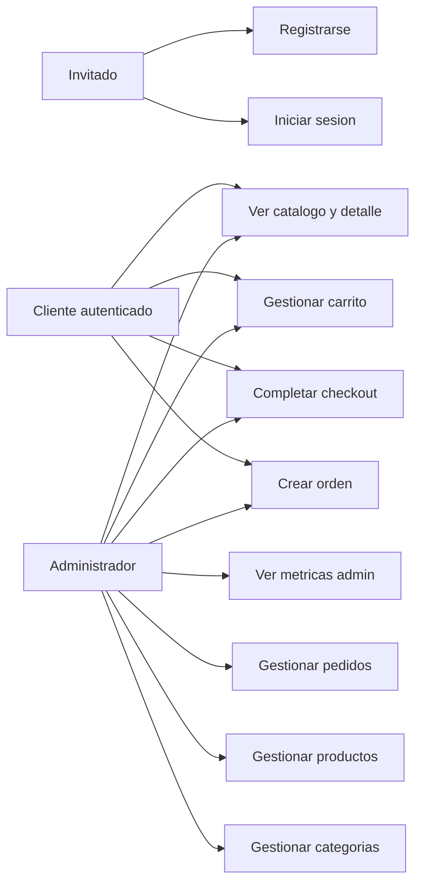
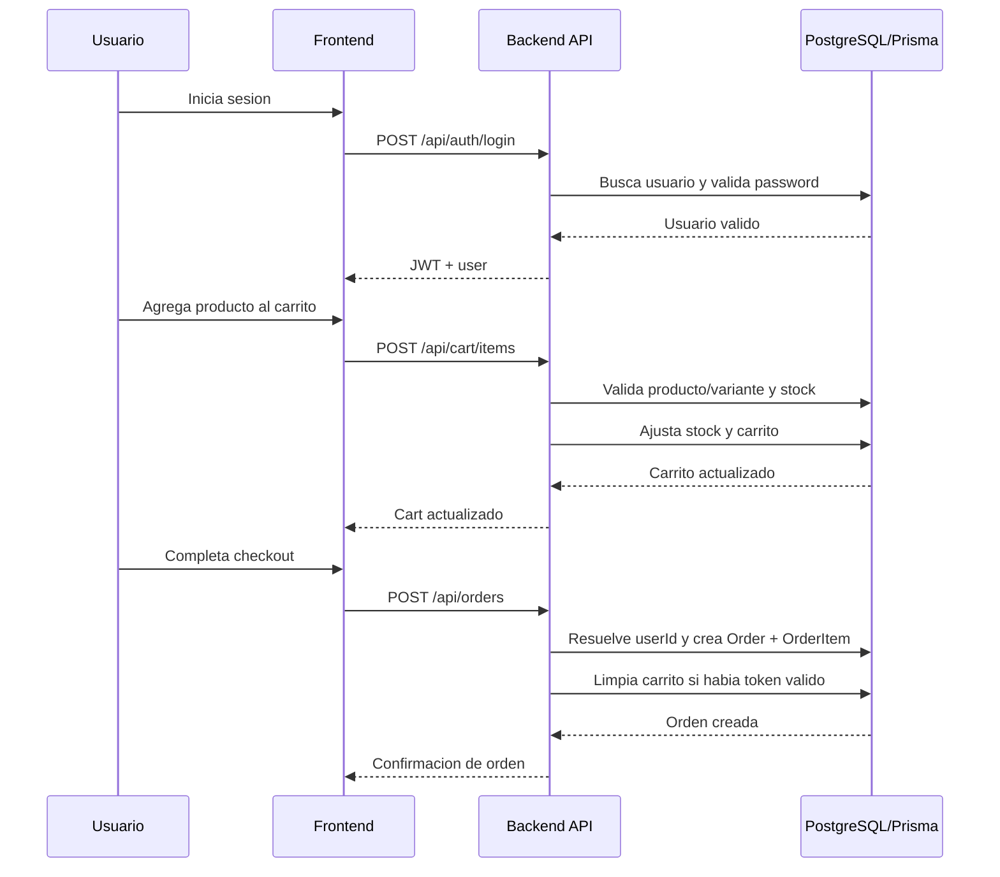
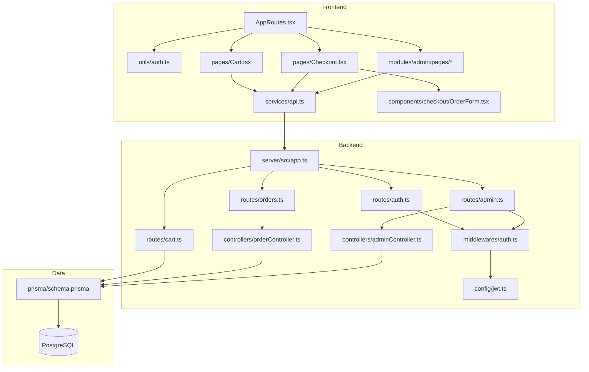

# Diagramas de arquitectura

## Alcance

Este documento cubre la parte de `QA-020` asociada a diagramas minimos del sistema.

## Convencion

- Los diagramas describen el estado actual observado en codigo.
- Si una decision de negocio o arquitectura no esta cerrada, se anota debajo del diagrama como pendiente.
- Las propuestas futuras se separan al final.

## Estado actual observado en codigo

### Diagrama de casos de uso

Nota de estado actual:

- El diagrama refleja que el frontend opera principalmente sobre usuario autenticado.
- El backend actual permite creacion de orden sin token, pero ese punto queda como decision pendiente, no como politica cerrada.

### Diagrama de secuencia del flujo de compra

Notas de estado actual:

- Hoy el backend calcula el total con `items.price * quantity`.
- Hoy la reserva/liberacion de stock ocurre en operaciones de carrito.
- El punto exacto donde debe reservarse stock sigue pendiente de confirmacion como regla oficial.

### Diagrama de componentes frontend/backend

## Decisiones pendientes por confirmar con el equipo

- Si el flujo de compra canonico debe exigir autenticacion completa o permitir invitado.
- Si los estados de orden del admin representan la taxonomia oficial del dominio.
- Si el manejo actual de JWT en `localStorage` se mantendra como diseno vigente.

## Propuesta de estandarizacion futura

- Convertir estos diagramas en anexos permanentes de arquitectura y mantenerlos versionados junto con cambios de rutas, modelos y contratos.
- Si el equipo define decisiones oficiales sobre sesion, stock y ordenes, reflejarlas en una segunda iteracion de diagramas con mayor nivel de detalle.
